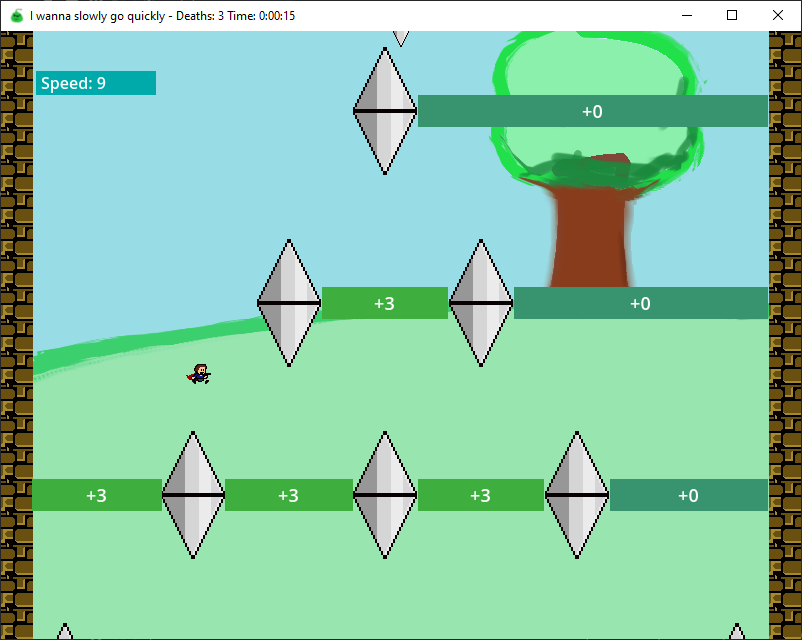

# I Wanna Slowly Go Quickly

An aiwanna made for the [I Wanna Twourney](https://iwannatwourney.com/).

Project made in Godot v4.2.1, using [ReloadedK's godot fangame engine v1.3](https://github.com/ReloadedK-git/ReloadedKs-Godot-Fangame-Engine)

---

---

# Change-log

### v1.0 (jan 24)

* Initial release for the twourney

### v1.1 (27 may 24)

* Finally got round to making an update
* Kid physics changed to be more accurate to normal aiwannas
* Added sound effects to almost everything
* Attempt to avoid lag spike by preloading shaders
* Minor nerfs/changes overall in an attempt to make things a bit more intuitive
* Zoop blocks now reset when landing
* Removed a +1 in room 1 as it was somehow possible to win when collecting them all
* Fixed mouse cursor not being visible
* Fixed window not being resizeable
* Added P for Pause
* Prevent djump during falling section of final boss

### v1.1.1 (3 june 24)

* Add one tiny change to a screen that I forgot to do
* Fix save softlock
* Add to github \o/
* Add to delfruit \o/
